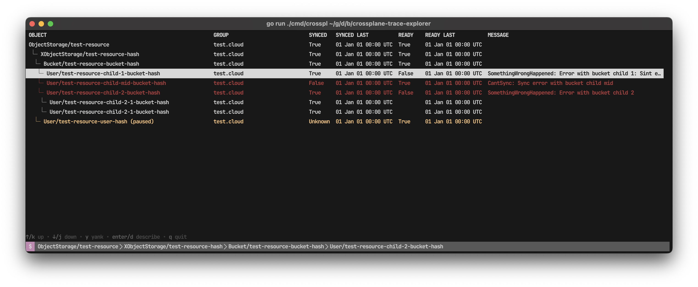

<h1 align="center">
  crossplane-explorer
</h1>

<p align="center">
  🧰 Enhanced Crossplane explorer
</p>



`crossplane trace` is a very handy tool, but it is not very interactive and requires a few extra
hops to properly debug its traced objects. This tool aims on closing this gap by providing
an interactive tracing explorer based on the tool tracer output.

## ✨ Features

### Trace

✨ Expanded details at a glance
📋 Allow full object name yanking from selected items
📖 Describe selected trace object details easily
♻️ (WIP) Automatic trace refresh

### Upcoming

- Call Kubernetes API when describing object
- Allow mutating resource annotations (pause, finaliser)

## 📀 Install

### Linux and Windows

[Check the releases section](https://github.com/brunoluiz/crossplane-explorer/releases) for more information details.

### MacOS

```
brew install brunoluiz/tap/crossplane-explorer
```

### Other

Use `go install` to install it

```
go install github.com/brunoluiz/crossplane-explorer@latest
```

## ⚙️ Usage

You must have `crossplane` installed. Run the tracer with `-o json` and pipe it to this tool.

```
crossplane beta trace Bucket/test-resource-bucket-hash -o json | crossplane-explorer
```

## 🧾 To-do

- Re-do the `addNodes` feature
- Add comments to functions
- Review hooks x Elm Bubble model
- Allow short and wide table format
- Understand why first render of statusbar is not rendering selected path without hack
